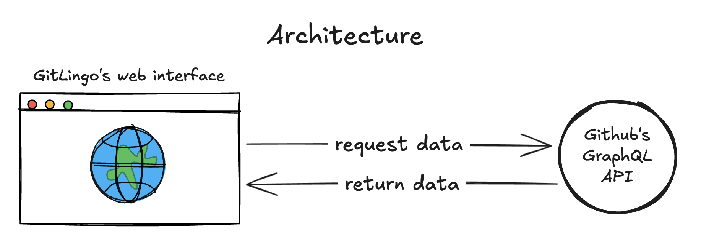
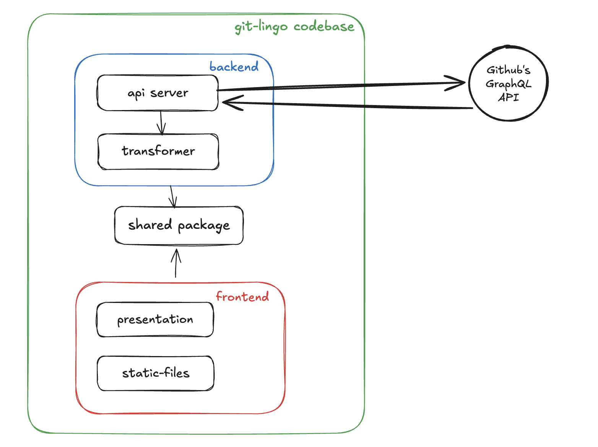
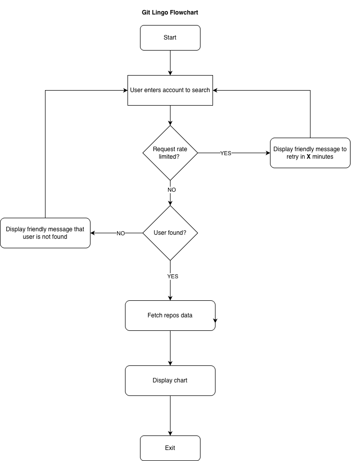

# Architecture

GitLingo backend is designed following **Domain-Driven Design (DDD)** principles with a strong focus on:
- maintainability
- extensibility
- testability
- clear separation of concerns

The backend acts as an orchestration layer between the frontend and external version control providers (initially GitHub via GraphQL). 

## High-level architecture



## Detailed architecture



The backend is mainly responsible for:
- receiving search requests from frontend
- fetching repository metadata from Github GraphQL API
- transforming raw provider data into domain models
- returning structured statistics to frontend

You can get creative about the module naming, codebase structure, and so on. But in principle, it should follow Domain-Driven Development (DDD) architecture and strive for **maintainability** and **extensibility**. 

For example, in the future we might want to persist the user search to external storage to get "top search". You should account for such potential integration. We might also consider to integrate this platform with other version control tools such as Gitlab and many more so we should accommodate such flexibility when implementing the architecture. But keep in mind also to avoid "premature optimization/abstraction" and "unnecessary complexity".

## Flowchart

Here's the flowchart of the application end-to-end.



## Functional requirement

### Search account statistics
- accept a github username or organization name
- validate input format
- fetch repositories via provider
- return language statistis:
    - grouped by language
    - includes repo count
    - includes language color metadata
- details will be explained in the API contracts section

### Provider abstraction
- backend must fetch repositories through a `ProviderPort` (or whatever better name you have)
- initial implementation: Github GraphQL
- must allow future providers (Gitlab, Bitbucket, etc.)

### Error handling (consistent, machine-readable)
Backend must return structured errors for:
- account not found
- rate limited
- invalid input
- provider/API failures
- timeout
- unexpected server errors

Errors should be consistent and safe (don't leak internal traces)

### Rate limiting awareness
- detect github rate limiting
- return friendly retry guidance
- optionally expose `retry_after_seconds` in the response payload

### Extensibility hooks (future-proofing)
Backend architecture must accommodate:
- persisting searches (top searches / trending)
- adding caching
- supporting multiple providers

## Non-functional requirement

### Accuracy
- aggregation must match provider truth
- language colors must map correctly to Github Linguist data
- deterministic ordering and calculation

### Performance
- graphQL queries must request **only** required fields
- avoid N+1 patterns

Target latency (excluding network variance):
- small accounts: < 500ms
- large accounts: < 1s

### Reliability
- no crashes on high-repo accounts
- graceful degradation for provider downtime
- retry for transient provider errors (out-of-the-box)
- clear error responses

### Scalability
- stateless backend
- horizontally scalable
- config-driven (no hardcoded env assumptions)

### Maintainability
- strict boundaries between layers
- ports/adapters pattern
- clear naming + folder conventions
- high test coverage

### Testability
- domain + application testable without HTTP
- provider mockable through `ProviderPort` (or whatever better name you have)
- integration tests for `/api/v1/search` and provider behavior

### Security
- input validation
- basic abuse protection (rate limiting)
- proper secret handling for provider tokens (if used)
- avoid returning raw provider errors

# API contracts

For now, let's only provide single endpoint for frontend to interact with backend and display the relevant information:

`/api/v1/search`

## Query params:

| Name | Type | Rules |
|---|---|---|
| username | string | Required. Provider-specific username rules. For GitHub: [A-Za-z0-9-]+ (additional GitHub edge rules can be validated server-side) |
| provider | string | Optional. Defaults to `github`. Allowed: `github`, `gitlab`, `bitbucket` |

## Success Response:

```json
{
  "ok": true,
  "provider": "github",
  "profile": {
    "username": "octocat",
    "type": "user",
    "providerUserId": "1",
    "avatarUrl": "https://avatars.githubusercontent.com/u/583231?v=4"
  },
  "series": [
    { "key": "JavaScript", "label": "JavaScript", "value": 100, "color": "#f1e05a" },
    { "key": "Python", "label": "Python", "value": 10, "color": "#3572A5" },
    { "key": "__forks__", "label": "Forked repos", "value": 200, "color": "#ededed" }
  ],
  "metadata": {
    "generatedAt": "2026-02-14T02:10:00.000Z",
    "unit": "repos",
    "limit": 20
  }
}
```

**Field explanation**

| Name | Type | Notes |
| --- | --- | --- |
| ok | boolean | `true` for success, `false` for errors |
| provider | string | provider name |
| profile | object | details of the user profile. this consists of name and user type |
| series | array of objects | Chart-ready list. Each entry is a bucket |
| metadata | object | Metadata information about the request |

## Error response

```json
{
  "ok": false,
  "provider": "github",
  "error": {
    "code": "user_not_found",
    "message": "The specified user was not found.",
    "details": {
      "username": "octocat"
    }
  },
  "meta": {
    "generatedAt": "2026-02-14T02:10:00.000Z"
  }
}
```

**Field explanation**

| Name | Type | Notes |
| --- | --- | --- |
| ok | string | Always `false` for error responses |
| provider | string | provider name |
| error | object | details of the error response. this consists of code, message and details |
| meta | object (optional) | metadata information | 

TBD

# Stacks
- Express + TypeScript
- zod (for interoperability with frontend)
- @octokit/graphql
- pino + pino-http for logging
- helmet + cors
- express-rate-limit
- supertest for testing
- eslint + prettier
- Docker