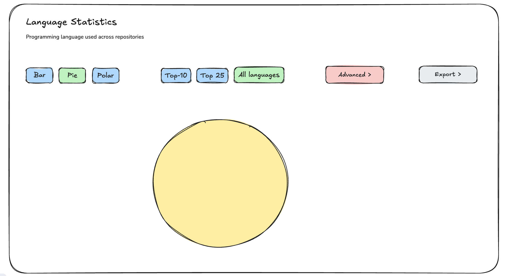

## What

Make one aligned toolbar row: chart types + Top-N + Options + Export

## Why

Right now controls feel like separate pieces; this is a polish multiplier

## How

- Left: chart types
- Middle: Top-N segmented control
- Right: Advanced dropdown (forks and unknowns inclusion) + Export dropdown
- Ensure consistent sizing and spacing (tailwind utilities)

See image below as illustration. Make it stunning with your own idea but still align with the current design.

## Success criteria

- Toolbar looks deliberate and balanced at common widths
- No control floats awkwardly alone